#CS/JVM #CS/JVM/GC 
```java
public class App {
    static User admin = new User("admin");

    public void process() {
        Order order = new Order();
        order.setUser(new User("guest"));
        
        Payment payment = new Payment(order);
        
        new Log("temp");
    }
}
```

---

## 실행 전 — static 초기화

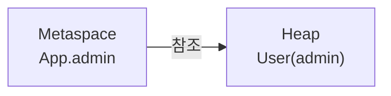

---

## process() 호출 직후

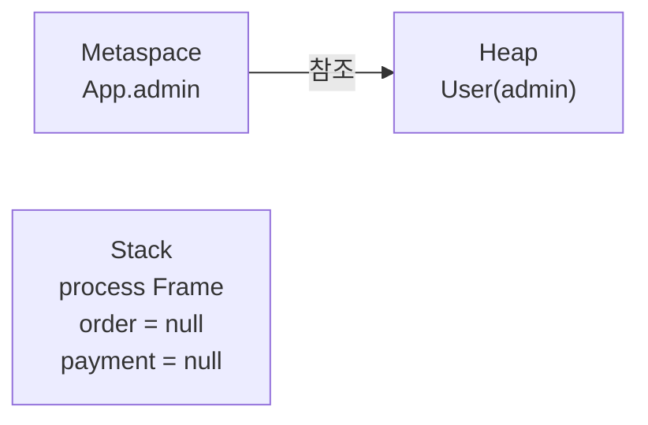

---

## Order 생성 후

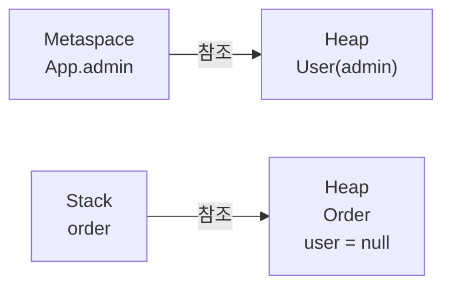

---

## User guest 생성 후

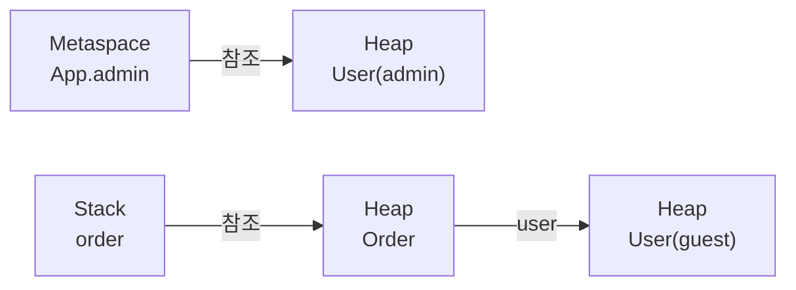

---

## Payment 생성 후

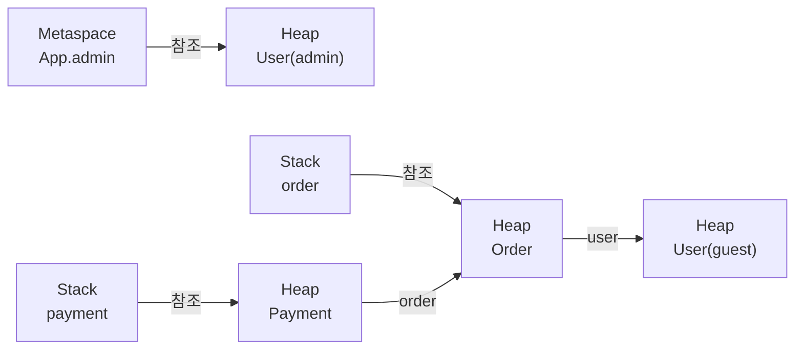

---

## Log temp 생성 후

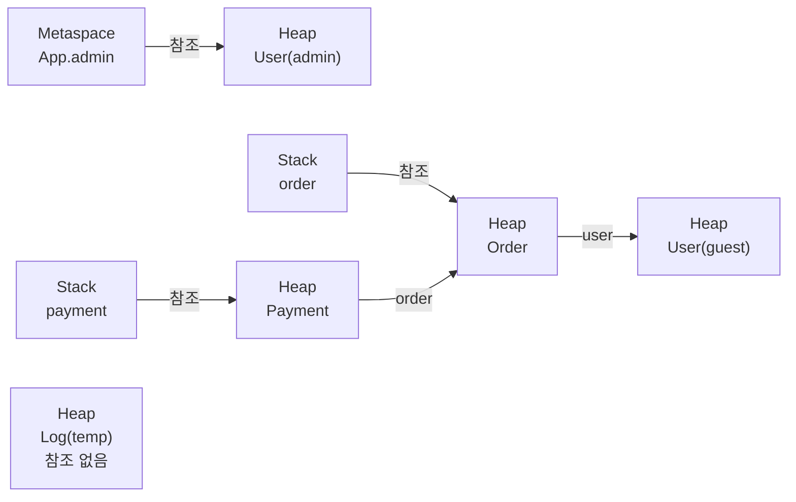

---

## process() 종료 — Stack Frame 제거

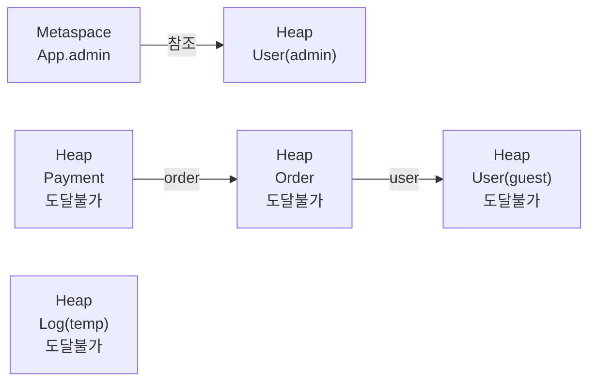

---

## Minor GC — 마킹

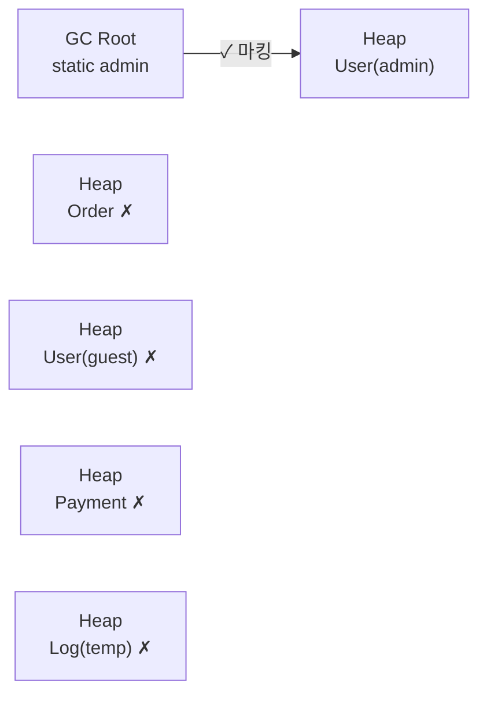

---

## Minor GC — 수거 후

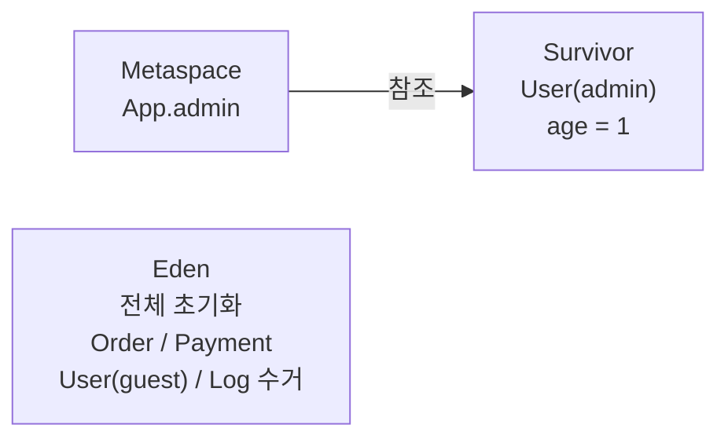

---

## 이후 생주기 — Old애 Gen 승격

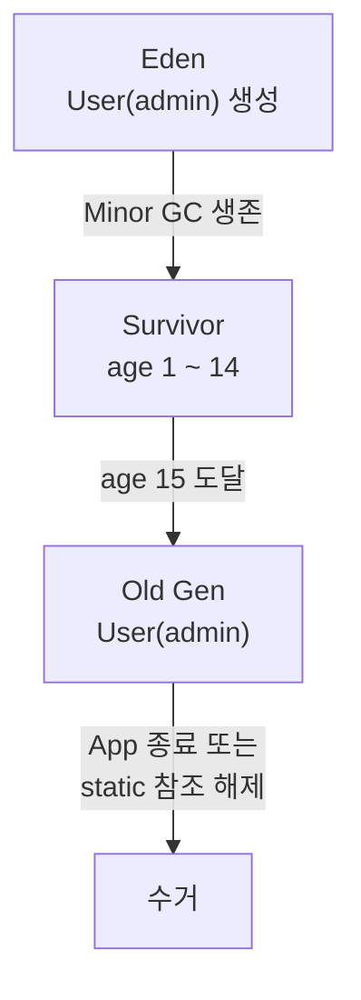

---

## 전체 생애주기 요약

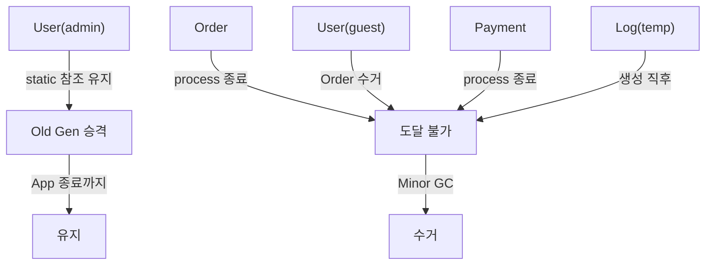

---

# `new User("guest")`의 메모리 할당 위치

## 결론부터

`new User("guest")`로 생성된 객체 자체는 **힙에만 생성**됩니다. 
스택에는 **참조값(reference)** 만 잠깐 존재했다가 사라집니다.

---

## Mechanics

### 바이트코드 레벨에서 추적

```java
order.setUser(new User("guest"));
```

이 한 줄이 바이트코드로 변환되면:

```
// 1. order 참조를 스택에 로드
aload_2                    // operand stack: [order_ref]

// 2. 힙에 User 객체 공간 확보
new #User                  // 힙에 객체 생성, operand stack: [order_ref, user_ref]

// 3. 스택 top에 user_ref 복사 (생성자 호출용)
dup                        // operand stack: [order_ref, user_ref, user_ref]

// 4. 생성자 호출 — dup으로 복사된 ref 소비됨
invokespecial User.<init>  // operand stack: [order_ref, user_ref]

// 5. setUser 호출 — user_ref 소비됨
invokevirtual order.setUser // operand stack: []
```

**핵심**: 스택(정확히는 JVM operand stack)에 올라간 것은 **힙 주소값** 뿐입니다. 
`User` 객체의 필드(`name = "guest"` 등)는 처음부터 끝까지 **힙에만** 존재합니다.

---

### 스택 vs 힙 — 실제로 뭐가 어디에 있나
![[../../../../../Repository/스택&힙 매핑과 생애주기-1.png]]

`new User("guest")`의 참조가 **로컬 변수 슬롯에 저장된 적이 없기 때문에**, operand stack을 스쳐 `setUser()`로 넘어간 순간 스택 프레임에서 흔적이 사라집니다.

---

### 만약 변수에 담았다면?

```java
User guest = new User("guest");   // local variable slot 할당
order.setUser(guest);
```

이 경우:

- 힙: `User` 객체 (동일)
- local variable table slot 2: `guest` → 힙 주소 저장
- `process()` 가 끝날 때까지 슬롯이 살아있음

**객체 자체가 스택에 올라가는 건 이 경우에도 동일하게 없습니다.** 차이는 오직 **reference를 담는 로컬 변수 슬롯의 존재 여부**입니다.

---

### 공식 근거

> _"The Java virtual machine stack stores frames. [...] Local variables and partial results are stored in a frame."_ — JVM Specification §2.5.2, §2.6
> 
> (한국어) JVM 스택은 프레임을 저장한다. 로컬 변수와 중간 연산 결과는 프레임 안에 저장된다.

> _"The heap is the run-time data area from which memory for all class instances and arrays is allocated."_ — JVM Specification §2.5.3
> 
> (한국어) 힙은 모든 클래스 인스턴스와 배열을 위한 메모리가 할당되는 런타임 데이터 영역이다.

즉, **`new` 키워드는 항상 힙 할당**이고, 스택은 그 주소를 잠깐 들고 있을 뿐입니다.

---

## 덧붙임 — Escape Analysis (JIT 최적화)

이론적 예외로, HotSpot JIT의 **Escape Analysis**가 활성화되면 
(`-XX:+DoEscapeAnalysis`, JDK 6u23부터 기본값 on) 
힙 할당 자체를 없애고 **스택 프레임에 스칼라로 펼쳐버리는 Stack Allocation**이 가능합니다.

하지만 이 경우 `setUser()`로 외부 객체(`order`)에 참조가 넘어가는 순간 **"탈출(escape)"로 판단**되어 최적화 대상에서 제외됩니다. 즉 현재 코드에서는 Escape Analysis도 작동하지 않습니다.