```java
public class App {
    static User admin = new User("admin");

    public void process() {
        Order order = new Order();
        order.setUser(new User("guest"));
        
        Payment payment = new Payment(order);
        
        new Log("temp");
    }
}
```

---

## 실행 전 — static 초기화

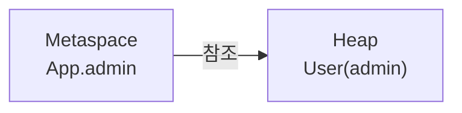

---

## process() 호출 직후

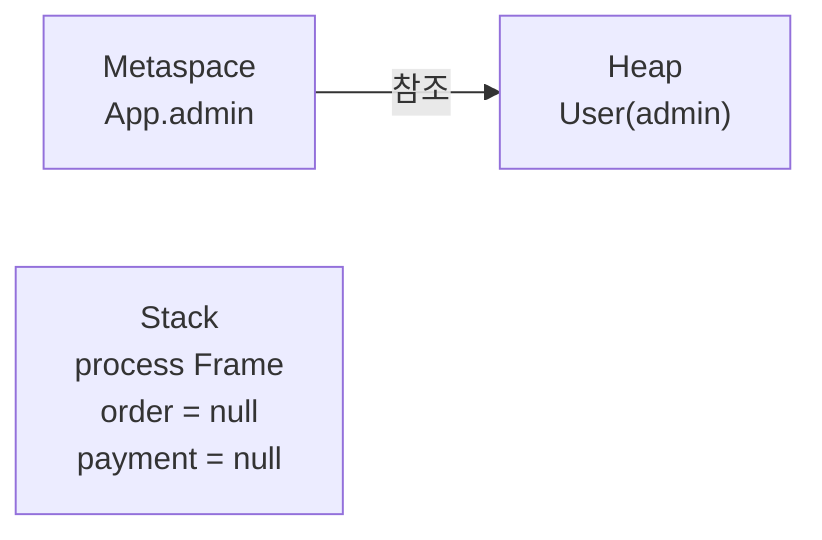

---

## Order 생성 후

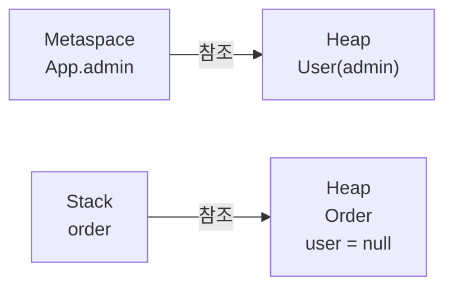

---

## User guest 생성 후

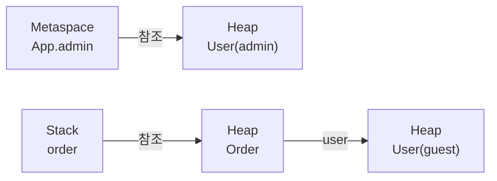

---

## Payment 생성 후

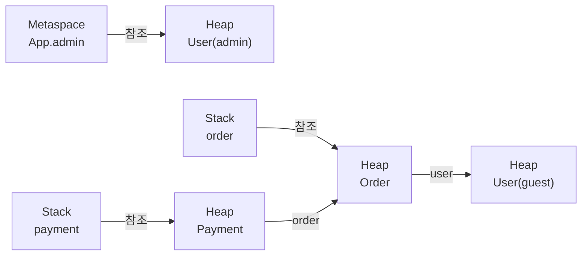

---

## Log temp 생성 후

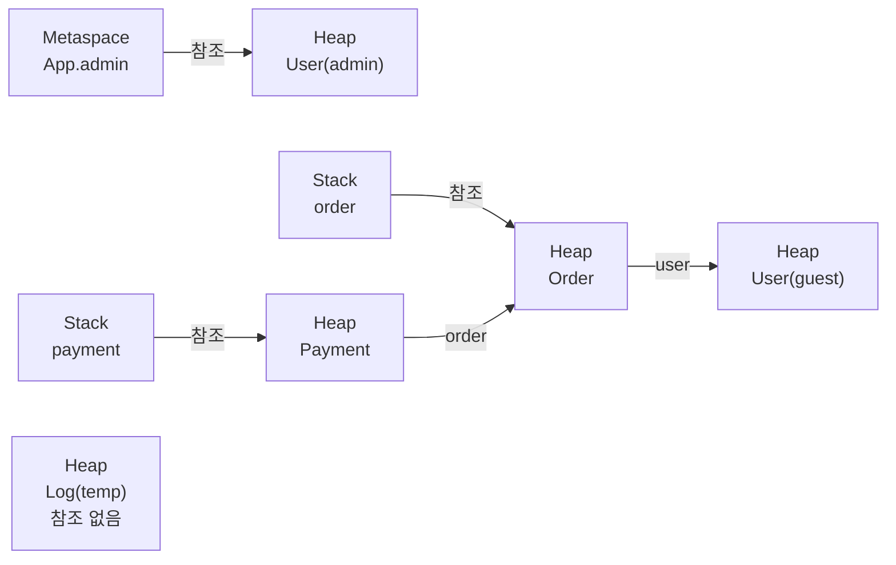

---

## process() 종료 — Stack Frame 제거

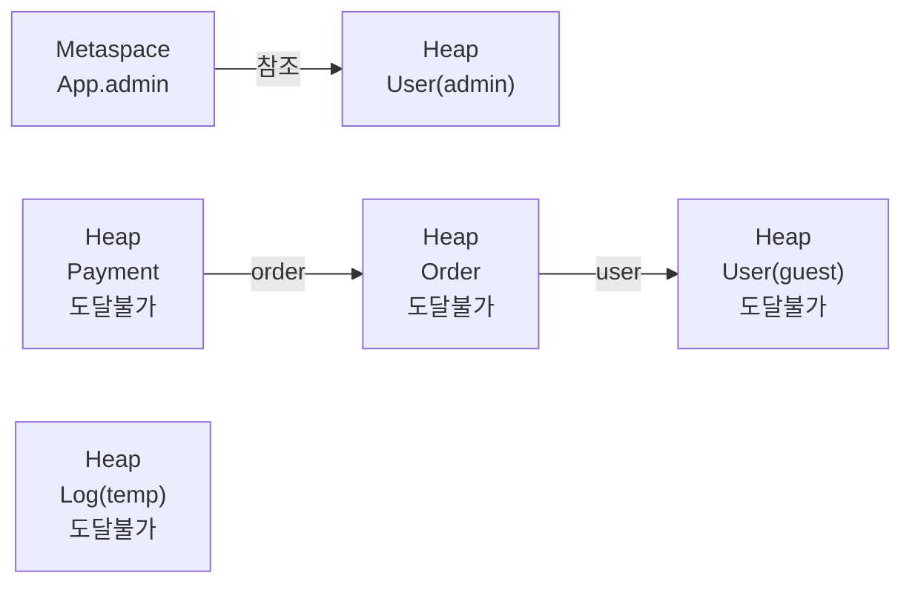

---

## Minor GC — 마킹

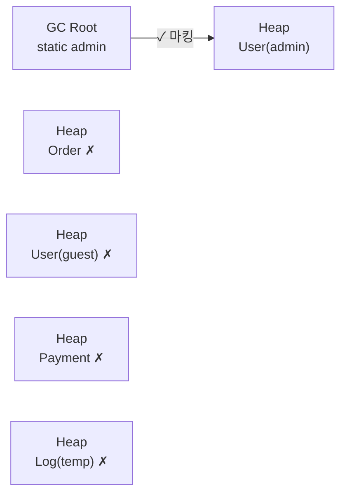

---

## Minor GC — 수거 후

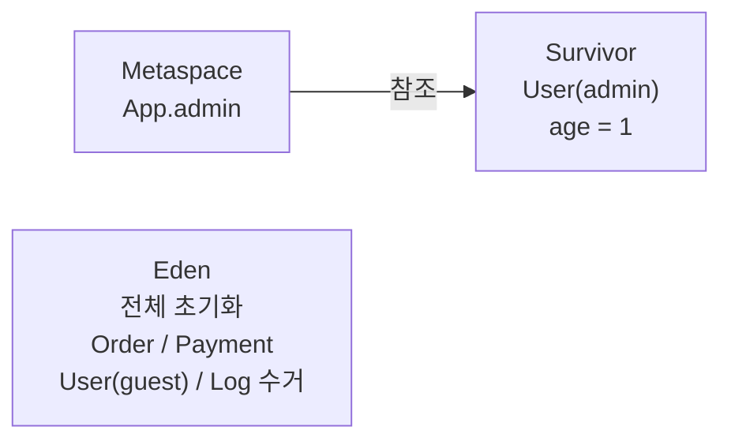

---

## 이후 생애주기 — Old Gen 승격

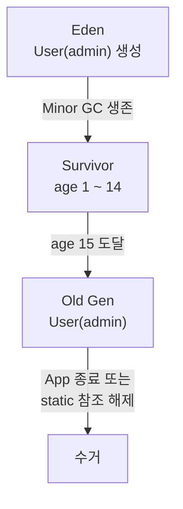

---

## 전체 생애주기 요약

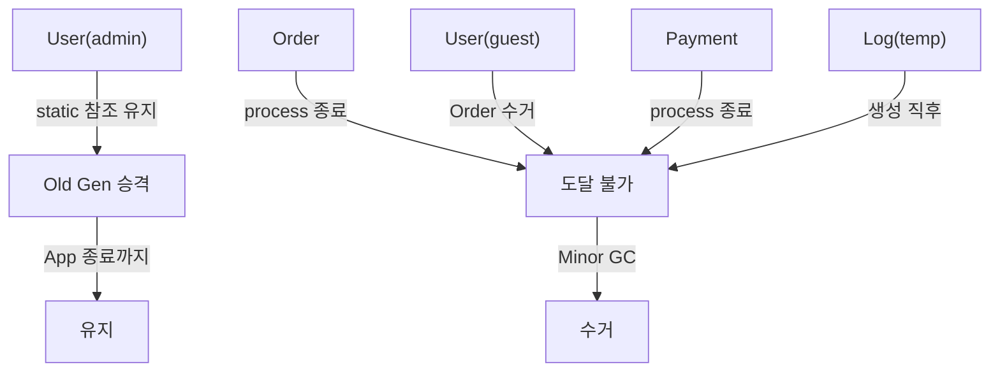

---

